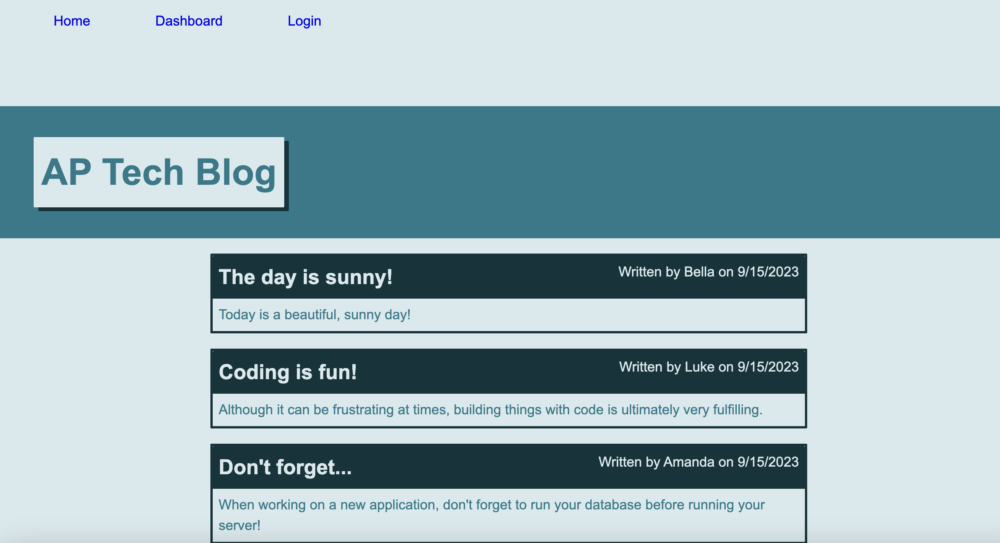

# APTechBlog

Welcome to AP Tech Blog! This application is a CMS-style blog site where developers can publish blog posts and comment on other blog posts. The application follows the MVC paradigm in structure.

## Technology

The application utilizes Handlebars.js as the templating language, Sequelize as the ORM (object-relational mapping), and the express-session npm package for authentication.

## Funtionality

Users can expect the following app functionality:

* When they initially visit the site, they are presented with a homepage that displays recent blog posts.
* If they click on any of the posts, they are taken to that post's page where they can read the post and place a comment.
* If they would like to publish a post, they can click on "login" in the navigation, where they can either sign up as a new user or log in if they are an existing user.
* When they log in or sign up, they are taken to a dashboard page where they can see their posts and add new posts.
* From the dashboard page they click on any of their existing posts and either edit them or delete them.
* Finally, the user can log out from the navigation.

## Screenshot

## Link to deployed application

[Here is a link to the deployed application!](https://peaceful-island-97542-55b14652157d.herokuapp.com/)