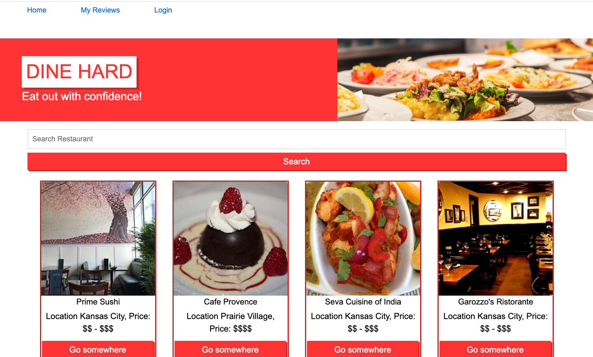

# DINE HARD

Welcome to Dine Hard! This application is a CMS-style review site where users can search for restaurants by location, read and publish restaurant reviews as well as comment on existint reviews when logged in. 

## Technology

The application utilizes Handlebars.js as the templating language, MySQL and Sequelize ORM for the database, bootstrap CSS library, and the express-session npm package for authentication. It also utilizes the Starry Rating npm package library as well as TripAdvisor rapid API for search queries.

## Funtionality

Users can expect the following app functionality:

* When they initially visit the site, they are presented with a homepage that displays a search bar for searching restaurants by location.
* After searching for restaurant by city, they are presented with restaurant options from that city.
* If they click on any of the restaurants, they are taken to that restaurant's page where they can learn more about the location and see any associated reviews.
* If they would like to publish a review, they can click on "login" in the navigation, where they can either sign up as a new user or log in if they are an existing user.
* When they log in or sign up, they are taken to a dashboard page where they can see their reviews.
* From the dashboard page they click on any of their existing reviews and either edit them or delete them.
* Finally, the user can log out from the navigation.

## Screenshot

## Link to deployed application

[Here is a link to the deployed application!](https://afternoon-everglades-28793-2b4d32cb92bf.herokuapp.com/)